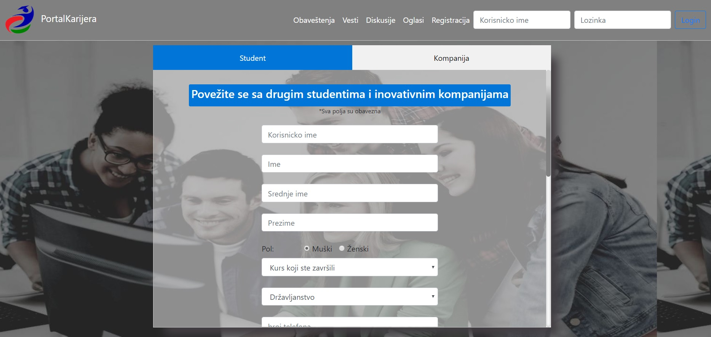
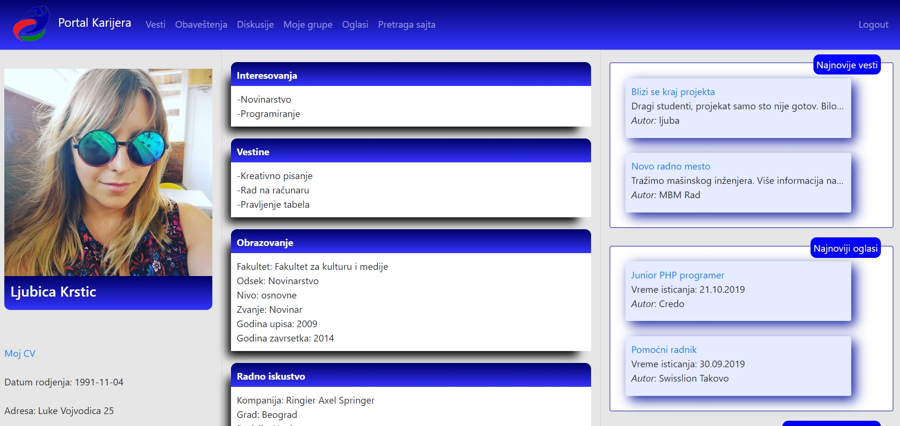
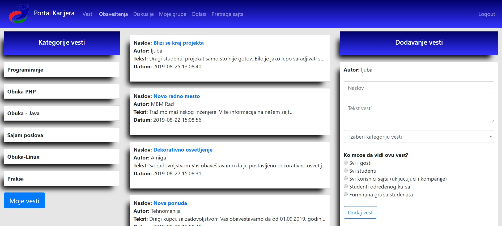
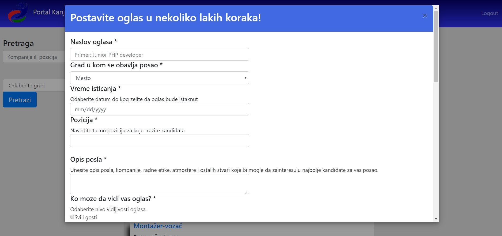
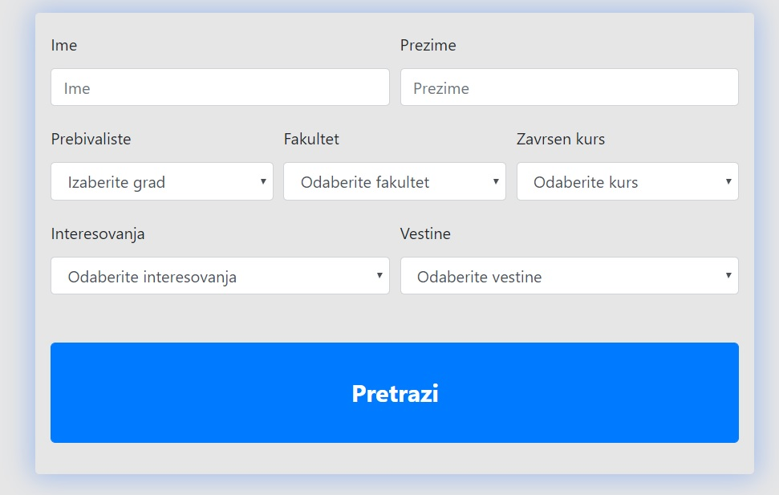
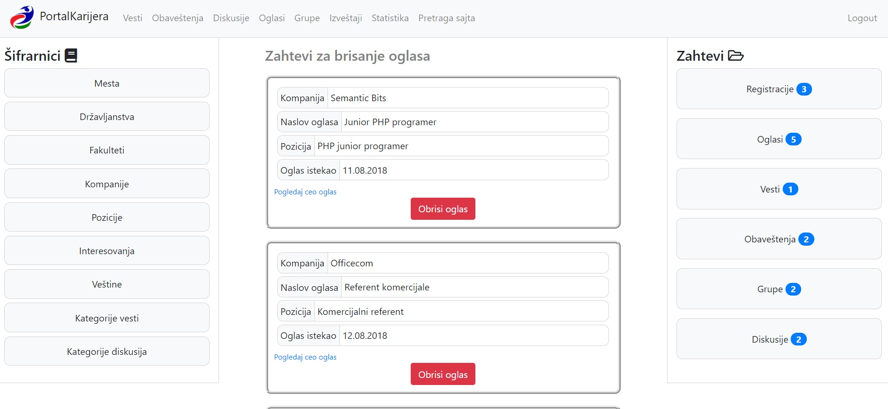

# Karijera - web app for connecting IT students and employers
This is a simple to use and dynamic web app, that helps students get in touch with potential employers, and also lets us collect and process data about registered students. 

## Table of contents

* [General info](#general-info)
* [Technologies](#technologies)
* [Setup](#setup)
* [Features](#features)
* [Screenshots](#screenshots)

## General info
Purpose of this project was to make a website that would allow certified attendees of IT retraining program to register, make a profile and get in touch with companies that are looking to recruit new talents, as well as with other students. It also allows companies to register and post job ads, send announcements, post news, browse registered students by multiple criteria, make groups of students or start discussions with them on different topics (like a forum). Website allows administrators to collect, process and send data about registered users. We have four types of users: guest, student, company and admin. 

## Technologies
* PHP
* Ajax
* JavaScript
* CSS
* Bootstrap
* Codeigniter
* WampServer
* MySql 

## Setup
To see our project in action, please install [WampServer](http://www.wampserver.com/en/download-wampserver-64bits/) and make sure all services are running. 

Download this repo to the folder named "www", which you will find inside your Wamp folder. Please make sure the name of the project on your computer (inside "www") is "portalKarijera". Ok? Ok! We're almost done!

Next, you need to load the database (it's a file named karijera.sql in repo) which can easily be done in [MySQL Workbench](https://www.mysql.com/products/workbench/). Open Workbench, click "file", then "Open SQL Script", and choose script "karijera.sql" from the repo you downloaded. Execute the script and that's it. 

You can also use phpMyAdmin, which comes with Wamp. Open it, go to "import", choose this script and click "go". 
Open the project in an IDE of your choice. We used [Netbeans](https://netbeans.org). You can run the project now. 

To log in as a *student*, use username "**ljuba**" and password "**123**";

To log in as a *company*, use username "**Officecom**" and password "__oFFice#*12__";

To log in as an *admin*, use username "**boka**" and password "**k259*O**";

## Features
* Log in/registration
* Reset password (new password is sent on user's e-mail)
* Posting news, announcements, job ads and choosing who can see it. We have six different levels of visibility: everyone (including the guests), all users, all students, students of a specific course, students that are the result of the search or all members of a particular group. 
* Group conversations (forum)
* Search all users by many parameters 
* Updating user information
* Approving or declining registration
* Sending reports on e-mail
* Adding, deleting or updating items in codebooks (for admin)
* Much, much more!

## Screenshots

#### Registration
After basic info is validated, student can add their interests, skills, previous education, employment information, etc. Students can log in after registration, while companies can submit their registration, but are only allowed to log in after admin has approved the registration. 

#### User profile
Both students and companies have their profile pages, with photo/logo and all public info. Users can see the latest news, announcements and job ads on their profiles. 

#### News page
Users can read and/or post news, depending on the type of the user. 

#### Job ads
Posting a job ad (only companies can to this). After it expires, ad can only be seen by the author. Author can send a request for an expired ad to be deleted altogether, and admin is the only one who can approve or decline that request. 

##### Search students or companies

#### Admin page
Admin has access to all registration and delete requests, and they also can update all the codebooks in database, as well as make reports and statistics about users. After the registration has been approved or declined, user is automatically notified via e-mail address that they have left in registration process. 

